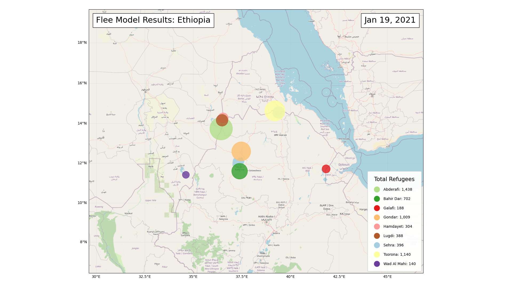

# Flee Ensemble Modeling and Visualization

This repo contains updates to the Flee and Flare models for the purpose of ensembling them. It also contains code for optionally generating movies from the ensemble results.

## Setup and Installation

To install Flee, run `pip3 install -r requirements.txt`. If you plan to use produce movie visuailzations you will also need to install [Cartopy](https://scitools.org.uk/cartopy/docs/latest/installing.html) and [FFmpeg](https://www.ffmpeg.org/download.html). For Cartopy, it is recommended to install using Conda.

## Usage

```
python3 run_ensemble.py nigeria 10 --ndays 100 --MaxMoveSpeed 220 --ConflictMoveChance 0.8 --DefaultMoveChance 0.05 --CampMoveChance 0.2 --flare --movie
```

Note: the `--flare` and `--movie` flags are optional. The `--flare` flag uses Flare for conflict generations. The `--movie` flag generates a movie with Cartopy.

## Results

Results are written to `run/`. Each ensemble run has its own numbered directory; the combined results are available in `run/output/camp_data.csv`. The movie is saved to `run/media/flee_movie.mp4`.



